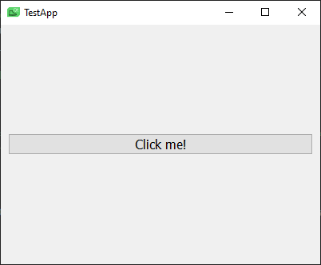

# QtStrap

Qt is excellent, but it's also enormous. There's a lot of topics, and many of them have hidden gotchas. PySide2 and PyQt are also excellent, letting us leverage the powerful Qt libraries from up in the clouds in PythonLand, but this arrangement has its own gotchas. 

The goal of qtstrap is get your applications up and running quickly, so you can focus on your problem instead of on Qt's idiosyncracies.

# Features

More complete docs are available [here](https://qtstrap.github.io/qtstrap/).

* `qtstrap` command line tool to bootstrap new projects
* crossplatform makefile with useful development commands
* preconfigured pyinstaller spec file
* preconfigured InnoSetup setup compiler script
* custom Qt widgets with useful behaviors
* Pythonic layout system using ContextLayouts
* Some other stuff I haven't remembered yet

# Dependencies

* Python 3
* PySide2 or PyQt5
* Make(optional, but recommended)

# Installation

Adding qtstrap to an existing project is easy
```sh 
python3 -m pip install qtstrap
```

This is the recommended way to create a new project using qtstrap:
```sh
$ mkdir test && cd test
$ python3 -m venv .venv
$ source .venv/bin/activate
$ python3 -m pip install qtstrap PySide2
$ qtstrap init
```

The init script will prompt you to enter the name of your application and the name of its publisher(which is probably you), and then it will generate an application skeleton. At this point you can deactivate the virtual environment and forget it exists(until you need to add a package or something).

You can test that everything installed properly by executing:
```sh
$ make run
```
If you see a window like this, then you're good to go:

 

